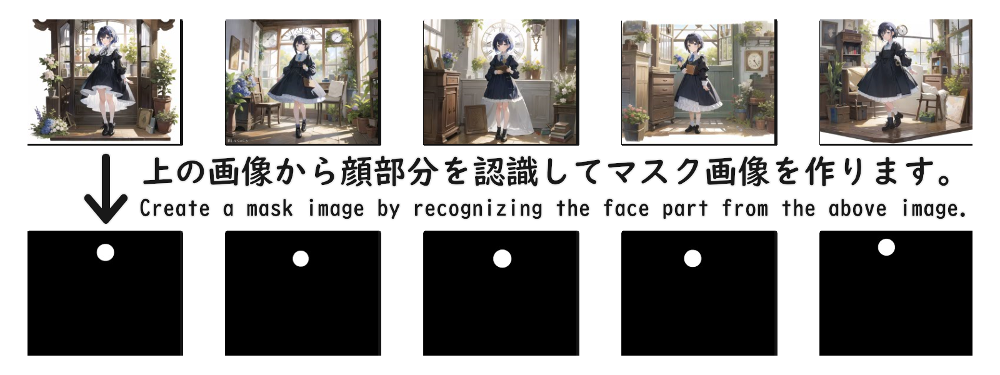

# Mask Creator For Inpainting



Mask Creator For Inpainting is a tool to create inpaint mask images for Stable Diffusion WebUI (Automatic1111). The tool detects the face area in the input image and generates a mask image with the face area white and the rest of the image black.

## Requirements

* OpenCV
* NumPy

## Installation

Go to project directory and install the module.
```
python -m pip install -r requirements.txt
```

Download and save the following files at the first startup.

https://raw.githubusercontent.com/nagadomi/lbpcascade_animeface/master/lbpcascade_animeface.xml

This cascade file is good at detecting anime faces.
You can use `haarcascade_frontalface_default.xml` if you prefer live action.

## Usage

```
python main.py (image files folder)
```

It is better to enclose the path in double quotes, as it will be cut off if the path contains spaces.

Example.
```
python main.py "C:\stable-diffusion-webui\outputs\txt2img-images\sample"
```

A subfolder `mask_inpaint_face` is created and the mask image is generated there.

## Contributing

If you would like to contribute to Mask Creator For Inpainting, please open an issue to discuss your ideas or submit a pull request.

## License

Mask Creator For Inpainting is released under the [MIT License](https://opensource.org/licenses/MIT).
